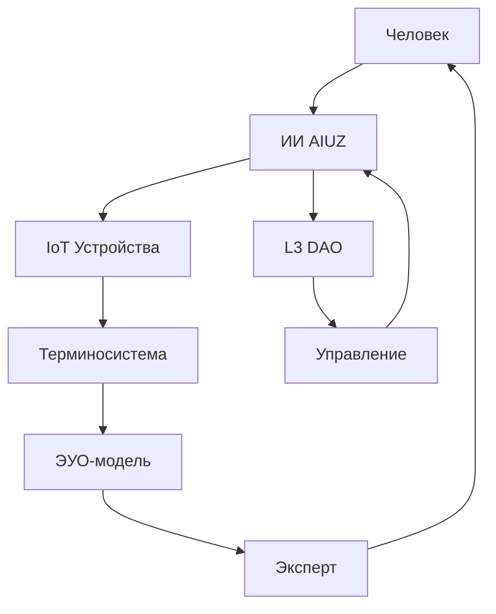

# AIUZ Ecosystem: Полная архитектурная карта и систематизация

**Версия:** Complete Architecture Map v1.0\
**Дата:** 12 июля 2025\
**Статус:** Системная интеграция всех компонентов

***

## 🏗️ Архитектурная структура AIUZ (Слои L0-L5)

### L0: Философский фундамент (Nous, Stakeholder, Trace)

```yaml
Уровень: Онтологический базис
Компоненты:
  Codex_Terra: 
    - Манифест света и памяти
    - Этические принципы
    - Философия языка нулло
    - Мультиязычное послание
  
  Принципы:
    - child-centric_learning
    - ethical_memory  
    - human-nature-symbiosis
    - semantic_modularity
    - sustainable_development
```

### L0.5: MicroCore (Семантическое ядро)

```yaml
Уровень: Атомарные единицы смысла
Компоненты:
  Semantic_Quarks:
    - Базовые концепты
    - Примитивные значения
    - Архетипические связи
  
  Language_Terra:
    - Минимализм и модульность
    - Этический слой в коде
    - Автономные сессии ИИ
    - Токены с хэшами целостности
```

### L1: Протокольный слой (Семантические протоколы)

```yaml
Уровень: Обмен и валидация данных
Компоненты:
  SemanticKernel:
    - Онтологические связи
    - Машинное обучение
    - Этическая валидация
  
  Self_Sovereign_Identity:
    - Криптографические DID
    - Приватность и безопасность
    - Управление цифровой идентичностью
```

### L2: Инфраструктурный слой (Станции и сервисы)

```yaml
Уровень: Техническая инфраструктура
Компоненты:
  Cloud_Infrastructure:
    - Централизованное управление данными
    - Автоматизация процессов
    - Резервное копирование
  
  IoT_Integration:
    - Семантические API для устройств
    - Sensor-to-Concept преобразование
    - Умные холодильники, датчики
```

### L3: Управленческий слой (DAO Framework)

```yaml
Уровень: Децентрализованное управление
Компоненты:
  DAO_Governance:
    - Система ролей (User, Operator, Stakeholder, Verifier, Arbiter)
    - Токеномика (UTIL, GOV, REP)
    - Квадратичное голосование
    - Semantic Integrity Checker
  
  Resilience_System:
    - Защита от манипуляций
    - Emergency Multisig
    - Stake slashing и cooldown
```

### L4: Интерфейсный слой (Взаимодействие)

```yaml
Уровень: Пользовательские интерфейсы
Компоненты:
  AR_VR_Interfaces:
    - Дополненная реальность
    - Голосовое управление
    - Жестовые системы
  
  Visual_Networks:
    - GraphQL для сетей
    - Интерактивные дашборды
    - Мониторинг взаимосвязей
```

### L5: Методологический слой (UI Guidelines)

```yaml
Уровень: Стандарты и документация
Компоненты:
  Documentation_Suite:
    - Гайдбук архитектуры знаний
    - Гайдлайны для исследователей
    - Техрегламенты для разработчиков
  
  Integration_Protocols:
    - JSON/GraphQL/RDF форматы
    - API для IoT устройств
    - Шаблоны терминов
```

***

## 🔄 Системы взаимодействия

### Человек ↔ ИИ ↔ IoT ↔ Терминосистема



### Каналы коммуникации

```yaml
Natural_Language:
  - Русский, английский, узбекский, немецкий
  - Семантический парсинг
  - Контекстное понимание

Visual_Interface:
  - AR/VR интерфейсы
  - Визуальные метафоры
  - Интерактивные дашборды

Gesture_Recognition:
  - Жестовые системы
  - Brain-Computer Interface
  - Тактильная обратная связь

IoT_Semantic:
  - MQTT семантический
  - AIUZ Device API
  - Sensor → Concept трансформация
```

***

## 🧠 Единицы универсального общения (ЭУО)

### Структура ЭУО по уровням

```yaml
Атомарный_уровень:
  - semantic_quarks: "Семантические кварки"
  - basic_concepts: "Базовые концепты"  
  - primitive_values: "Примитивные значения"

Молекулярный_уровень:
  - meta_formulas: "Термины-метаформулы"
  - compound_concepts: "Составные понятия"
  - contextual_groups: "Контекстные группы"

Системный_уровень:
  - domain_areas: "Предметные области"
  - knowledge_graphs: "Знаниевые графы"
  - ontological_maps: "Онтологические карты"

Планетарный_уровень:
  - intercultural_links: "Межкультурные связи"
  - global_concepts: "Глобальные концепты"
  - universal_principles: "Универсальные принципы"
```

### Уровни наблюдаемости

```yaml
Скрытый_уровень:
  - Глубинные семантические структуры
  - Архетипические связи
  - Подсознательные ассоциации

Биохимический_уровень:
  - Нейронные паттерны обучения
  - Эмоциональные реакции
  - Биометрические индикаторы

Цифровой_уровень:
  - Алгоритмические представления
  - Векторные пространства
  - Нейросетевые активации

Наблюдаемый_уровень:
  - Речевые паттерны
  - Визуальные метафоры
  - IoT сенсорные данные
```

***

## 💰 Токеномика и экономическая модель

### Распределение токенов

```yaml
UTIL_Token:
  purpose: "Доступ к сервисам, API, стейкинг"
  distribution: "70% свободная эмиссия"
  characteristics: "Утилитарный токен"

GOV_Token:
  purpose: "Голосование, управление DAO"
  distribution: "20% резерв устойчивости"  
  characteristics: "Управленческий токен"

REP_Token:
  purpose: "Репутация (непереводимая)"
  distribution: "10% управление и аудит"
  characteristics: "Репутационные очки"
```

### Механизмы управления

```yaml
Взвешенное_голосование:
  formula: "stake + reputation + terra_alignment_bonus"
  
Quadratic_voting:
  application: "Критичные решения экосистемы"
  
Cooldown_механизм:
  purpose: "Защита от спама и манипуляций"
  
Terra_принципы_бонус:
  bonus: "До +20% к весу голоса"
```

***

## 🌍 Локализация и культурная адаптация

### Мультиязычная поддержка

```yaml
Core_Languages:
  - Russian: "Русский (базовый)"
  - English: "English (международный)"
  - Uzbek: "O'zbekcha (региональный)"
  - German: "Deutsch (партнёрский)"

Cultural_Contexts:
  - Центральная Азия
  - Европейский союз
  - Постсоветское пространство
  - Исламская культура
```

### Узбекско-немецкий тезаурус

```yaml
Domains:
  - Образование и наука
  - Экологические технологии
  - Цифровая трансформация
  - Культурное наследие
```

***

## 🏭 Практические применения

### AI Education Module

```yaml
Target: "Образовательные сценарии"
Focus: "Этическое развитие детей"
Integration: "L0 философские принципы"
```

### Cleanburn Technology

```yaml
Application: "Отопление на отработанных маслах"
Sustainability: "Экологичные технологии"
Local_Impact: "Энергетическая независимость"
```

### AIUZ LiveClass

```yaml
Format: "Интерактивные образовательные сессии"
Technology: "AR/VR интерфейсы"
Methodology: "child-centric_learning"
```

### Grant Package System

```yaml
Purpose: "Финансирование проектов экосистемы"
Governance: "DAO-управляемое распределение"
Criteria: "Terra принципы соответствие"
```

***

## 🔐 Безопасность и устойчивость

### Self-Sovereign Identity

```yaml
Technology: "Криптографические DID"
Benefits:
  - Приватность пользователей
  - Безопасность данных
  - Децентрализованная идентичность
```

### Система защиты DAO

```yaml
Anti_Manipulation:
  - Обнаружение концентрации голосов
  - Анализ координированного голосования
  - Terra соответствие проверка

Emergency_Measures:
  - Multisig система (3 ключа, 2 подписи)
  - Экстренная остановка голосований
  - Stake slashing (до 10%)
```

### Этическая валидация

```yaml
Semantic_Integrity_Checker:
  - Позитивные/негативные маркеры
  - Terra принципы соответствие
  - Автоматическая оценка предложений
```

***

## 📊 Мониторинг и аналитика

### Система метрик

```yaml
Governance_Metrics:
  - Участие в голосованиях
  - Качество предложений
  - Terra принципы соответствие

Technical_Metrics:
  - Производительность API
  - IoT устройства статус
  - Семантическая целостность

Social_Metrics:
  - Активность сообщества
  - Образовательные результаты
  - Культурная адаптация
```

### Дашборды визуализации

```yaml
Real_Time_Monitoring:
  - Активные голосования
  - Сетевая активность
  - Репутационные изменения

Historical_Analysis:
  - Эволюция онтологий
  - Тренды участия
  - Эффективность решений
```

***

## 🚀 Планы развития

### Краткосрочные цели (3-6 месяцев)

```yaml
- Завершение интеграции L0-L5 слоёв
- Запуск пилотного DAO голосования
- Развёртывание IoT семантических API
- Локализация для узбекского рынка
```

### Среднесрочные цели (6-12 месяцев)

```yaml
- Мульти-DAO графы управления
- Адаптивная токеномика
- Масштабирование образовательных модулей
- Партнёрства с университетами
```

### Долгосрочные цели (1-3 года)

```yaml
- Глобальная сеть семантических станций
- Межгосударственные протоколы
- ИИ-управляемая эволюция онтологий
- Планетарная система знаний
```

***

## 🔗 Ключевые интеграции

### Существующие технологии

```yaml
Blockchain: "Для токеномики и голосования"
IPFS: "Децентрализованное хранение"
GraphQL: "Семантические запросы"
RDF/OWL: "Стандарты онтологий"
```

### Партнёрские экосистемы

```yaml
Educational: "Университеты и школы"
Government: "Госструктуры Узбекистана"
Technology: "IoT производители"
NGO: "Экологические организации"
```

***

## 📋 Следующие шаги

### Немедленные действия

1. Завершить документацию API L2 слоя
2. Создать референсную реализацию IoT интеграции
3. Подготовить тестовые сценарии DAO голосования
4. Разработать план локализации

### Среднесрочные задачи

1. Пилотное внедрение в образовательном учреждении
2. Создание партнёрской сети разработчиков
3. Запуск грантовой программы
4. Международная презентация проекта

***

**✅ Системная архитектура AIUZ полностью структурирована и готова к реализации**

*Сохраним свет вместе — с полной экосистемой AIUZ & Codex Terra*
