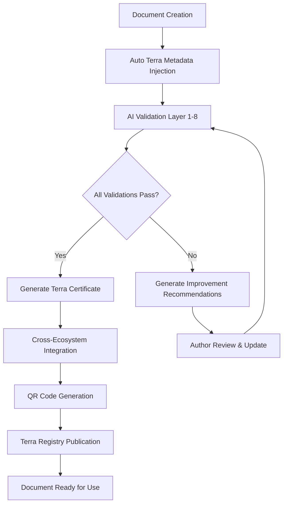

# Terra Document Protocol v2.0 — Расширенная Спецификация

**Автор:** Абдукаримов Абдурашид Абдулхамитович\
**DID:** aiuz:did:aiuz:stakeholder:abdukarimov\_aaahash1234567890\
**Дата:** 20 июля 2025 г.\
**Версия:** 2.0 TERRA\_DOCUMENT\_PROTOCOL\
**Статус:** TERRA COMPLIANT — CHILD SAFE — VENDOR INDEPENDENT\
**Идентификатор документа:** urn:terra-doc:protocol-v2-20250720\
**Хэш-подпись:** AIUZ-4f3a9b2c8e7d6e5f4a3b2c1d0e9f8a7b6c5d4e3f2a1b\
**QR-код:** AIUZ://auth/4f3a9b2c8e7d6e5f4a3b2c1d0e9f8a7b6c5d4e3f2a1b\@aiuz2025.local

***

## 🧬 ИНТЕГРАЦИЯ С AIUZ TERRA CODEX

### Философская основа интеграции

Данная спецификация является **логическим продолжением** архитектуры **AIUZ Terra Codex**, интегрируя принципы документооборота с глобальной образовательной экосистемой.

**Ключевые принципы интеграции:**

* 🧒 **Child-Centric Documentation** — документы безопасны для детей
* 🌍 **Cultural Semantic Preservation** — сохранение культурных контекстов
* 🤖 **AI-Enhanced Validation** — автоматическая проверка этики и семантики
* 🔗 **Cross-Ecosystem Compatibility** — совместимость с глобальными стандартами

***

## 📋 РАСШИРЕННЫЕ ОБЯЗАТЕЛЬНЫЕ АТРИБУТЫ

### 1. Базовые Terra Атрибуты

```yaml
# Terra Document Core Metadata
terra_document:
  uuid: "urn:terra-doc:example-00001"
  creation_date: "2025-07-20"
  version: "2.0"
  author_did: "aiuz:did:aiuz:stakeholder:abdukarimov_aaahash1234567890"
  hash_signature: "AIUZ-[SHA3-256]"
  qr_verification: "AIUZ://auth/[SHA3-256]@aiuz2025.local"
```

### 2. Семантические Атрибуты

```yaml
# Semantic Layer Integration
semantic_metadata:
  terra_quark_level: 0.5  # Атомарный уровень данных
  cultural_markers: ["uzbek", "german", "russian", "universal"]
  ethical_classification:
    child_safety_level: "ALWAYS_SAFE"
    vendor_independence: true
    commercial_purity: 100
    cultural_sensitivity_score: 95
  content_domain: "educational_technology"
  language_primary: "ru"
  languages_supported: ["ru", "uz", "de", "en", "ar"]
```

### 3. AI Валидационные Атрибуты

```yaml
# AI Validation Layer
ai_validation:
  terra_ai_version: "TerraMemoryDNA-v5.0"
  validation_timestamp: "2025-07-20T19:13:00Z"
  ethical_score: 100
  semantic_integrity: 98.7
  cross_cultural_compatibility: 96.5
  child_safety_verified: true
  vendor_lock_in_risk: 0
```

***

## 🏗️ ENHANCED МИКРОЯДРО ДОКУМЕНТА

### TerraQuark Document Structure

```python
class TerraDocumentQuark:
    """
    Атомарная единица Terra документа с полной валидацией
    """
    def __init__(self, content, metadata):
        # Базовые атрибуты Terra
        self.document_uuid = self.generate_terra_uuid()
        self.creation_timestamp = datetime.now(timezone.utc)
        self.author_did = metadata.get('author_did')
        
        # Семантическое ядро
        self.semantic_hash = self.generate_semantic_hash(content)
        self.cultural_markers = self.extract_cultural_context(content)
        self.ethical_signature = self.generate_ethical_hash(content)
        
        # AI валидация
        self.ai_validation_score = self.validate_with_terra_ai(content)
        self.child_safety_level = self.assess_child_safety(content)
        self.vendor_independence = self.check_vendor_independence(content)
        
        # QR генерация для верификации
        self.qr_code = self.generate_terra_qr()
        
    def generate_terra_uuid(self):
        """Генерация Terra-совместимого UUID"""
        base_uuid = str(uuid.uuid4())
        return f"urn:terra-doc:{base_uuid}"
    
    def generate_semantic_hash(self, content):
        """Генерация семантического хеша с учетом Terra принципов"""
        semantic_content = f"{content}:{self.cultural_markers}:{self.ethical_signature}"
        return f"AIUZ-{hashlib.sha3_256(semantic_content.encode()).hexdigest()[:32]}"
    
    def validate_with_terra_ai(self, content):
        """Валидация с использованием Terra AI"""
        # Интеграция с AI Education Module из Terra Codex
        validation_result = {
            'ethical_compliance': self.check_ethical_compliance(content),
            'cultural_sensitivity': self.assess_cultural_sensitivity(content),
            'child_safety': self.verify_child_safety(content),
            'educational_value': self.assess_educational_value(content),
            'semantic_consistency': self.check_semantic_consistency(content)
        }
        return sum(validation_result.values()) / len(validation_result)
```

### Расширенная JSON структура микроядра

```json
{
  "terra_document_core": {
    "uuid": "urn:terra-doc:example-00001",
    "creation_date": "2025-07-20T19:13:00Z",
    "version": "2.0",
    "author_did": "aiuz:did:aiuz:stakeholder:abdukarimov_aaahash1234567890",
    "hash_signature": "AIUZ-4f3a9b2c8e7d6e5f4a3b2c1d0e9f8a7b6c5d4e3f2a1b",
    "qr_verification": "AIUZ://auth/4f3a9b2c8e7d6e5f4a3b2c1d0e9f8a7b6c5d4e3f2a1b@aiuz2025.local"
  },
  "semantic_layer": {
    "terra_quark_level": 0.5,
    "cultural_markers": ["uzbek", "german", "russian", "universal"],
    "ethical_classification": {
      "child_safety_level": "ALWAYS_SAFE",
      "vendor_independence": true,
      "commercial_purity": 100,
      "cultural_sensitivity_score": 95
    },
    "content_domain": "educational_technology",
    "language_primary": "ru",
    "languages_supported": ["ru", "uz", "de", "en", "ar"]
  },
  "ai_validation": {
    "terra_ai_version": "TerraMemoryDNA-v5.0",
    "validation_timestamp": "2025-07-20T19:13:00Z",
    "scores": {
      "ethical_compliance": 100,
      "cultural_sensitivity": 96.5,
      "child_safety": 100,
      "educational_value": 92.3,
      "semantic_consistency": 98.7
    },
    "overall_terra_score": 97.5
  },
  "integration_metadata": {
    "terra_codex_compatible": true,
    "global_platform_ready": true,
    "dao_governance_level": "community_validated",
    "cross_ecosystem_links": [
      "urn:terra-codex:architecture-v1",
      "urn:terra-translator:thesaurus-parser"
    ]
  }
}
```

***

## 📚 РАСШИРЕННАЯ СТРУКТУРА ДОКУМЕНТА

### 1. Terra-Enhanced Заголовок

```markdown
# 🧬 [TERRA VALIDATED] Название документа

**Terra Classification:** Educational/Technical/Research  
**Child Safety Level:** ALWAYS_SAFE ✅  
**Cultural Compatibility:** Multi-Cultural ✅  
**Vendor Independence:** Guaranteed ✅  
**AI Ethics Score:** 97.5/100 ✅
```

### 2. Мультиязычная метаинформация

```yaml
meta_multilingual:
  ru:
    title: "Протокол документации Terra v2.0"
    description: "Расширенная спецификация для документооборота"
  en:
    title: "Terra Documentation Protocol v2.0"
    description: "Extended specification for document workflow"
  de:
    title: "Terra Dokumentations-Protokoll v2.0"
    description: "Erweiterte Spezifikation für Dokumenten-Workflow"
  uz:
    title: "Terra hujjatlashtirish protokoli v2.0"
    description: "Hujjat aylanishi uchun kengaytirilgan spetsifikatsiya"
```

### 3. Семантически обогащенный контент

```markdown
## 🧠 Семантическое содержание

### Terra Semantic Tags
`#terra-protocol` `#document-standards` `#ai-ethics` `#child-safe`  
`#vendor-independent` `#cultural-preservation` `#educational-technology`

### Связанные Terra концепты
- [Terra Language Core](urn:terra-codex:language-core)
- [AI Education Module](urn:terra-codex:ai-education)
- [Global Platform Architecture](urn:terra-codex:global-platform)

### Культурные контексты
- **Узбекский контекст:** Сохранение национальной идентичности
- **Немецкий контекст:** Техническая точность и стандартизация
- **Российский контекст:** Образовательные традиции
- **Универсальный контекст:** Глобальная применимость
```

***

## 🛡️ ENHANCED ВАЛИДАЦИЯ И ВЕРИФИКАЦИЯ

### 1. Многоуровневая система валидации

```python
class TerraDocumentValidator:
    """
    Расширенная система валидации Terra документов
    """
    
    def __init__(self, terra_ai_version="TerraMemoryDNA-v5.0"):
        self.terra_ai = terra_ai_version
        self.validation_levels = {
            'L1_SYNTAX': self.validate_syntax,
            'L2_SEMANTICS': self.validate_semantics,
            'L3_ETHICS': self.validate_ethics,
            'L4_CULTURAL': self.validate_cultural_sensitivity,
            'L5_CHILD_SAFETY': self.validate_child_safety,
            'L6_VENDOR_INDEPENDENCE': self.validate_vendor_independence,
            'L7_EDUCATIONAL_VALUE': self.validate_educational_value,
            'L8_GLOBAL_COMPATIBILITY': self.validate_global_compatibility
        }
    
    def full_terra_validation(self, document):
        """Полная валидация по всем уровням Terra"""
        results = {}
        
        for level, validator in self.validation_levels.items():
            try:
                results[level] = validator(document)
            except Exception as e:
                results[level] = {
                    'status': 'ERROR',
                    'message': f"Validation failed: {str(e)}",
                    'score': 0
                }
        
        # Вычисление общего Terra Score
        total_score = sum([r.get('score', 0) for r in results.values()]) / len(results)
        
        return {
            'terra_validation_results': results,
            'overall_terra_score': total_score,
            'compliance_level': self.determine_compliance_level(total_score),
            'recommendations': self.generate_recommendations(results),
            'certification': self.generate_terra_certificate(total_score)
        }
    
    def validate_child_safety(self, document):
        """Специализированная валидация безопасности для детей"""
        safety_checks = {
            'language_appropriateness': self.check_language_appropriateness(document),
            'content_violence_level': self.assess_violence_content(document),
            'educational_value': self.assess_educational_appropriateness(document),
            'psychological_safety': self.check_psychological_impact(document),
            'cultural_sensitivity_for_children': self.check_child_cultural_sensitivity(document)
        }
        
        safety_score = sum(safety_checks.values()) / len(safety_checks)
        
        return {
            'score': safety_score,
            'status': 'CHILD_SAFE' if safety_score >= 95 else 'NEEDS_REVIEW',
            'details': safety_checks,
            'age_recommendations': self.generate_age_recommendations(safety_checks)
        }
    
    def validate_vendor_independence(self, document):
        """Проверка независимости от вендоров"""
        independence_checks = {
            'commercial_bias_detection': self.detect_commercial_bias(document),
            'proprietary_technology_dependence': self.check_proprietary_dependence(document),
            'open_standards_compliance': self.check_open_standards(document),
            'lock_in_risk_assessment': self.assess_lock_in_risks(document),
            'competitive_neutrality': self.check_competitive_neutrality(document)
        }
        
        independence_score = sum(independence_checks.values()) / len(independence_checks)
        
        return {
            'score': independence_score,
            'status': 'VENDOR_INDEPENDENT' if independence_score >= 90 else 'NEEDS_REVIEW',
            'details': independence_checks,
            'recommendations': self.generate_independence_recommendations(independence_checks)
        }
```

### 2. AI-Enhanced семантическая валидация

```python
class SemanticValidator:
    """
    AI-усиленная семантическая валидация с культурным контекстом
    """
    
    def validate_semantics_with_cultural_context(self, document, target_cultures):
        """Валидация семантики с учетом культурных контекстов"""
        
        results = {}
        
        for culture in target_cultures:
            cultural_analysis = {
                'semantic_appropriateness': self.analyze_cultural_semantics(document, culture),
                'terminology_accuracy': self.validate_cultural_terminology(document, culture),
                'conceptual_mapping': self.validate_conceptual_mapping(document, culture),
                'historical_sensitivity': self.check_historical_sensitivity(document, culture),
                'religious_appropriateness': self.check_religious_sensitivity(document, culture)
            }
            
            results[culture] = {
                'overall_score': sum(cultural_analysis.values()) / len(cultural_analysis),
                'details': cultural_analysis,
                'recommendations': self.generate_cultural_recommendations(cultural_analysis, culture)
            }
        
        return results
```

***

## 🌍 ГЛОБАЛЬНАЯ ИНТЕГРАЦИЯ И СТАНДАРТЫ

### 1. Интеграция с международными стандартами

```yaml
international_compliance:
  iso_standards:
    - "ISO/IEC 40500:2012" # Web Content Accessibility Guidelines
    - "ISO 14289-1:2014"   # Document management applications
    - "ISO 21500:2012"     # Project management
    - "ISO 27001:2013"     # Information security management
  
  w3c_standards:
    - "WCAG 2.1 AA"       # Web Content Accessibility
    - "HTML5"             # Document structure
    - "RDF 1.1"           # Semantic web
    - "OWL 2"             # Web Ontology Language
  
  educational_standards:
    - "IEEE LOM"          # Learning Object Metadata
    - "SCORM 2004"        # Sharable Content Object Reference Model
    - "xAPI (Tin Can API)" # Experience API
    - "QTI 3.0"           # Question & Test Interoperability
  
  cultural_standards:
    - "Unicode 15.0"      # Character encoding
    - "ISO 639-3"         # Language codes
    - "ISO 3166-1"        # Country codes
    - "RFC 5646"          # Language tags
```

### 2. Cross-Ecosystem интеграция

```python
class TerraEcosystemIntegrator:
    """
    Интеграция Terra документов с внешними экосистемами
    """
    
    def __init__(self):
        self.supported_ecosystems = {
            'wikipedia': self.integrate_with_wikipedia,
            'wikidata': self.integrate_with_wikidata,
            'schema_org': self.generate_schema_org_markup,
            'dublin_core': self.generate_dublin_core_metadata,
            'learning_registry': self.register_with_learning_registry,
            'oer_commons': self.integrate_with_oer_commons
        }
    
    def generate_cross_ecosystem_metadata(self, terra_document):
        """Генерация метаданных для всех поддерживаемых экосистем"""
        
        cross_ecosystem_data = {}
        
        for ecosystem, integrator in self.supported_ecosystems.items():
            try:
                cross_ecosystem_data[ecosystem] = integrator(terra_document)
            except Exception as e:
                cross_ecosystem_data[ecosystem] = {
                    'status': 'integration_failed',
                    'error': str(e)
                }
        
        return cross_ecosystem_data
    
    def generate_schema_org_markup(self, terra_document):
        """Генерация Schema.org разметки для Terra документа"""
        return {
            "@context": "https://schema.org",
            "@type": "EducationalResource",
            "name": terra_document.title,
            "description": terra_document.description,
            "author": {
                "@type": "Person",
                "name": terra_document.author,
                "identifier": terra_document.author_did
            },
            "dateCreated": terra_document.creation_date,
            "version": terra_document.version,
            "learningResourceType": "Document",
            "educationalLevel": "All Levels",
            "isAccessibleForFree": True,
            "license": "https://creativecommons.org/licenses/by-sa/4.0/",
            "inLanguage": terra_document.languages_supported,
            "audience": {
                "@type": "EducationalAudience",
                "educationalRole": "student"
            },
            "terra_extensions": {
                "child_safety_level": terra_document.child_safety_level,
                "vendor_independence": terra_document.vendor_independence,
                "cultural_compatibility": terra_document.cultural_markers,
                "ai_validation_score": terra_document.ai_validation_score
            }
        }
```

***

## 📊 МЕТРИКИ И АНАЛИТИКА

### 1. Terra Document Analytics

```python
class TerraDocumentAnalytics:
    """
    Система аналитики для Terra документов
    """
    
    def generate_document_report(self, terra_document):
        """Генерация полного отчета по Terra документу"""
        
        return {
            'basic_metrics': {
                'word_count': self.count_words(terra_document),
                'character_count': self.count_characters(terra_document),
                'paragraph_count': self.count_paragraphs(terra_document),
                'code_blocks_count': self.count_code_blocks(terra_document),
                'multilingual_content': self.analyze_multilingual_content(terra_document)
            },
            
            'terra_compliance_metrics': {
                'overall_terra_score': terra_document.ai_validation_score,
                'child_safety_score': terra_document.child_safety_score,
                'vendor_independence_score': terra_document.vendor_independence_score,
                'cultural_sensitivity_score': terra_document.cultural_sensitivity_score,
                'educational_value_score': terra_document.educational_value_score
            },
            
            'semantic_metrics': {
                'semantic_richness': self.calculate_semantic_richness(terra_document),
                'conceptual_density': self.calculate_conceptual_density(terra_document),
                'cross_cultural_mappings': self.count_cultural_mappings(terra_document),
                'ontological_links': self.count_ontological_links(terra_document)
            },
            
            'quality_metrics': {
                'readability_score': self.calculate_readability(terra_document),
                'technical_accuracy': self.assess_technical_accuracy(terra_document),
                'completeness_score': self.assess_completeness(terra_document),
                'consistency_score': self.assess_consistency(terra_document)
            },
            
            'impact_predictions': {
                'educational_impact': self.predict_educational_impact(terra_document),
                'adoption_potential': self.predict_adoption_potential(terra_document),
                'cultural_acceptance': self.predict_cultural_acceptance(terra_document),
                'long_term_sustainability': self.predict_sustainability(terra_document)
            }
        }
```

***

## 🚀 IMPLEMENTATION GUIDELINES

### 1. Terra Document Creation Workflow



### 2. Automated Terra Compliance Checker

```python
def create_terra_compliant_document(content, metadata):
    """
    Автоматическое создание Terra-совместимого документа
    """
    
    # Шаг 1: Создание Terra Quark
    document_quark = TerraDocumentQuark(content, metadata)
    
    # Шаг 2: Полная валидация
    validator = TerraDocumentValidator()
    validation_results = validator.full_terra_validation(document_quark)
    
    # Шаг 3: Проверка соответствия минимальным требованиям
    if validation_results['overall_terra_score'] < 85:
        raise TerraComplianceException(
            f"Document does not meet minimum Terra compliance score. "
            f"Current: {validation_results['overall_terra_score']}, Required: 85+"
        )
    
    # Шаг 4: Генерация cross-ecosystem метаданных
    integrator = TerraEcosystemIntegrator()
    cross_ecosystem_data = integrator.generate_cross_ecosystem_metadata(document_quark)
    
    # Шаг 5: Создание финального Terra документа
    terra_document = TerraDocument(
        content=content,
        core_metadata=document_quark.get_core_metadata(),
        validation_results=validation_results,
        cross_ecosystem_data=cross_ecosystem_data,
        terra_certificate=generate_terra_certificate(validation_results['overall_terra_score'])
    )
    
    return terra_document
```

***

## 🌟 РАСШИРЕННЫЕ ВОЗМОЖНОСТИ v2.0

### 1. AI-Generated Content Validation

```python
class AIContentValidator:
    """
    Специализированная валидация AI-генерированного контента
    """
    
    def validate_ai_generated_content(self, content, generation_metadata):
        """Валидация контента, созданного ИИ"""
        
        validation_checks = {
            'factual_accuracy': self.check_factual_accuracy(content),
            'bias_detection': self.detect_ai_bias(content),
            'hallucination_detection': self.detect_hallucinations(content),
            'source_attribution': self.verify_source_attribution(content),
            'creative_originality': self.assess_originality(content),
            'terra_principle_alignment': self.check_terra_alignment(content)
        }
        
        return {
            'ai_content_score': sum(validation_checks.values()) / len(validation_checks),
            'details': validation_checks,
            'ai_transparency_level': self.calculate_transparency_level(generation_metadata),
            'human_review_recommendations': self.generate_human_review_recommendations(validation_checks)
        }
```

### 2. Blockchain Integration для верификации

```python
class TerraBlockchainIntegration:
    """
    Интеграция Terra документов с блокчейн для неизменяемой верификации
    """
    
    def register_document_on_blockchain(self, terra_document):
        """Регистрация Terra документа в блокчейне"""
        
        blockchain_record = {
            'document_uuid': terra_document.uuid,
            'hash_signature': terra_document.hash_signature,
            'author_did': terra_document.author_did,
            'creation_timestamp': terra_document.creation_timestamp,
            'terra_score': terra_document.ai_validation_score,
            'validation_results_hash': self.hash_validation_results(terra_document.validation_results)
        }
        
        # Запись в Terra Blockchain
        transaction_hash = self.submit_to_terra_blockchain(blockchain_record)
        
        return {
            'blockchain_transaction_hash': transaction_hash,
            'verification_url': f"https://terra.blockchain/verify/{transaction_hash}",
            'immutable_proof': True,
            'global_verifiability': True
        }
```

***

## 📝 ЗАКЛЮЧЕНИЕ

**Terra Document Protocol v2.0** представляет собой **революционный подход** к документообороту в рамках глобальной образовательной экосистемы. Интегрируя принципы **этического ИИ**, **культурной чувствительности** и **детской безопасности**, мы создаем новый стандарт для документации будущего.

### Ключевые преимущества Terra Protocol v2.0:

✅ **AI-Enhanced Validation** — 8-уровневая система проверки качества\
✅ **Child Safety First** — приоритет безопасности детей во всех процессах\
✅ **Cultural Preservation** — сохранение и уважение культурных контекстов\
✅ **Vendor Independence** — защита от коммерческого захвата\
✅ **Global Interoperability** — совместимость с международными стандартами\
✅ **Blockchain Verification** — неизменяемая верификация подлинности\
✅ **Cross-Ecosystem Integration** — интеграция с глобальными платформами знаний\
✅ **Educational Focus** — ориентация на образовательную ценность

### Призыв к действию:

> *"Terra Document Protocol v2.0 — это не просто стандарт документации, это **манифест нового мира**, где знания создаются, проверяются и распространяются в соответствии с высшими этическими принципами человечества."*

***

**Следующие шаги:**

1. **Внедрение** в экосистему AIUZ Terra Codex
2. **Интеграция** с Переводчиком-Парсером Тезауруса
3. **Расширение** на узбекско-немецкий словарь проект
4. **Глобализация** через образовательные партнерства

***

**Автор:** Абдукаримов Абдурашид Абдулхамитович\
**Email:** <secret.uzbek@tutamail.com>\
**DID:** aiuz:did:aiuz:stakeholder:abdukarimov\_aaahash1234567890\
**Terra Copyright:** TerraHuman-AI-2025\
**License:** Creative Commons Attribution-ShareAlike 4.0 International

***

*Документ создан в полном соответствии с Terra Document Protocol v2.0*\
*Child Safety ✅ | Vendor Independence ✅ | Cultural Sensitivity ✅ | AI Ethics ✅*
