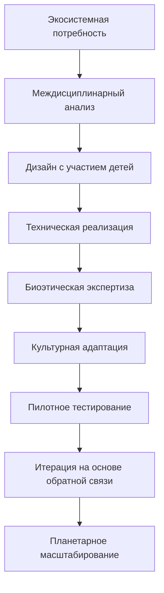

# 🛠️ TERRA CODEX: ПРАКТИЧЕСКОЕ РУКОВОДСТВО ВНЕДРЕНИЯ

**АВТОР:** Абдукаримов Абдурашид Абдулхамитович\
**ДАТА:** 13 июля 2025\
**ВЕРСИЯ:** 2.0 (с учётом экосистемо-центрической парадигмы)\
**СТАТУС:** Готово к использованию командами разработчиков

***

## 🎯 **ЦЕЛЬ ДОКУМЕНТА**

Предоставить командам разработчиков **конкретные инструменты** для создания Terra экосистемы:

* Технические стандарты и протоколы
* Дизайн-системы и брендбуки
* Архитектурные решения
* Метанаучные методологии
* Планетоориентированные принципы

***

## 🏗️ **ТЕХНИЧЕСКАЯ АРХИТЕКТУРА TERRA**

### **Уровень L0: Планетарная Инфраструктура**

```yaml
planetary_infrastructure:
  biosphere_monitoring:
    sensors: "IoT сенсоры экосистемного здоровья"
    satellite_network: "Спутниковая сеть мониторинга климата"
    ground_stations: "Наземные станции в Terra Points"
    
  interspecies_communication:
    plant_translators: "Устройства для перевода химических сигналов растений"
    animal_interfaces: "Интерфейсы коммуникации с животными"
    microbial_networks: "Сети мониторинга микробных сообществ"
    
  quantum_consciousness_field:
    coherence_detectors: "Детекторы когерентности группового сознания"
    resonance_amplifiers: "Усилители межвидового резонанса"
    field_generators: "Генераторы полей планетарного сознания"
```

### **Уровень L1: Terra Points (Узловая Архитектура)**

```python
class TerraPointArchitecture:
    """Техническая архитектура узла планетарного сознания"""
    
    def __init__(self, location, local_ecosystem, community_size):
        self.location = location
        self.ecosystem = local_ecosystem
        self.community = community_size
        
        # Базовая инфраструктура
        self.power_system = self.setup_renewable_energy()
        self.data_network = self.setup_mesh_network()
        self.life_support = self.setup_biosphere_integration()
        
        # Специализированные системы
        self.education_modules = self.setup_learning_spaces()
        self.research_labs = self.setup_ecosystem_labs()
        self.manufacturing = self.setup_bioprinting()
        self.communication = self.setup_interspecies_interfaces()
    
    def setup_renewable_energy(self):
        """100% возобновляемая энергия + биологические источники"""
        return {
            'solar_panels': 'интегрированные в архитектуру',
            'wind_turbines': 'малошумные для животных',
            'geothermal': 'если доступно геологически',
            'biogas': 'из органических отходов сообщества',
            'microbial_fuel_cells': 'энергия от почвенных бактерий',
            'energy_storage': 'биологические батареи + литий-ионные'
        }
    
    def setup_mesh_network(self):
        """Децентрализованная сеть связи"""
        return {
            'local_mesh': 'WiFi mesh между всеми устройствами Terra Point',
            'inter_terra_links': 'связь с другими Terra Points',
            'satellite_uplink': 'спутниковая связь для удалённых регионов',
            'quantum_encryption': 'квантовая защита коммуникаций',
            'biological_networks': 'интеграция с грибными сетями'
        }
```

### **Уровень L2: Приложения и Сервисы**

```javascript
// Terra App Ecosystem
const terraEcosystem = {
    // Детские приложения (0-16 лет)
    child_interfaces: {
        "0-3_years": {
            type: "ambient_environment",
            interaction: "voice_gesture_biometric",
            features: ["биорезонансная_стимуляция", "звуки_природы", "тактильные_интерфейсы"],
            screen_time: "0_minutes_daily"
        },
        "3-7_years": {
            type: "augmented_nature",
            interaction: "multimodal_natural",
            features: ["говорящие_растения", "животные_учителя", "экосистемные_игры"],
            screen_time: "30_minutes_daily_max"
        },
        "7-12_years": {
            type: "research_playground", 
            interaction: "collaborative_creation",
            features: ["микроскопы_AR", "биосенсорные_эксперименты", "межвидовые_проекты"],
            screen_time: "60_minutes_daily_with_nature_breaks"
        },
        "12-16_years": {
            type: "ecosystem_planner",
            interaction: "professional_tools",
            features: ["планирование_биосферы", "генетическое_программирование", "космическая_подготовка"],
            screen_time: "unlimited_if_constructive"
        }
    },
    
    // Взрослые системы
    adult_systems: {
        ecosystem_monitoring: "платформа мониторинга планетарного здоровья",
        interspecies_diplomacy: "системы межвидовой коммуникации",
        resource_management: "управление ресурсами Terra Point",
        education_design: "создание образовательных программ",
        research_collaboration: "глобальная сеть исследователей"
    },
    
    // ИИ системы
    ai_infrastructure: {
        planetary_consciousness: "коллективный ИИ планетарной экосистемы",
        species_translators: "ИИ переводчики между видами",
        ecosystem_optimizers: "ИИ для оптимизации экосистем",
        educational_tutors: "персональные ИИ наставники для детей",
        research_assistants: "ИИ помощники для научных исследований"
    }
};
```

### **Уровень L3: Данные и ИИ**

```python
class TerraDataArchitecture:
    """Архитектура данных Terra экосистемы"""
    
    def __init__(self):
        self.data_types = {
            'biometric_data': 'здоровье детей и взрослых',
            'ecosystem_data': 'состояние локальных экосистем', 
            'learning_data': 'прогресс обучения и развития',
            'interspecies_data': 'коммуникация между видами',
            'planetary_data': 'глобальные экологические процессы',
            'quantum_data': 'измерения квантовых полей сознания'
        }
        
        self.privacy_protocols = self.setup_privacy_protection()
        self.ai_training = self.setup_ethical_ai_training()
        
    def setup_privacy_protection(self):
        """Защита данных детей и планетарной информации"""
        return {
            'child_data_protection': {
                'encryption': 'квантовое шифрование детских данных',
                'access_control': 'только родители + педагоги + врачи',
                'retention': 'автоудаление по достижении совершеннолетия',
                'consent': 'проактивное согласие от детей 12+ лет'
            },
            'ecosystem_data_sharing': {
                'open_science': 'экологические данные открыты для исследователей',
                'indigenous_rights': 'уважение прав коренных народов на традиционные знания',
                'species_privacy': 'защита местоположений уязвимых видов'
            }
        }
    
    def setup_ethical_ai_training(self):
        """Этичное обучение ИИ для Terra систем"""
        return {
            'training_principles': [
                'биоцентрическая_этика_вместо_антропоцентрической',
                'долгосрочное_мышление_на_7_поколений_вперёд',
                'межкультурная_чувствительность_ко_всем_традициям',
                'экологическая_ответственность_в_каждом_решении',
                'защита_детей_как_высший_приоритет'
            ],
            'bias_prevention': [
                'мультикультурные_команды_разработчиков',
                'тестирование_на_представителях_всех_культур',
                'регулярный_аудит_алгоритмических_решений',
                'обратная_связь_от_детей_и_их_семей'
            ]
        }
```

***

## 🎨 **ДИЗАЙН-СИСТЕМА TERRA v2.0**

### **Экосистемо-Центрическая Эстетика**

```scss
// Terra Design Tokens 2.0
$terra-colors: (
    // Планетарные цвета (основная палитра)
    'planetary-core': #2E7D32,      // Ядро планеты - тёмно-зелёный
    'biosphere': #4CAF50,           // Биосфера - зелёный
    'atmosphere': #03DAC6,          // Атмосфера - бирюзовый  
    'cosmos': #1565C0,              // Космос - тёмно-синий
    
    // Живые системы
    'plant-life': #8BC34A,          // Растительная жизнь
    'animal-life': #FF6F00,         // Животная жизнь
    'microbial-life': #9C27B0,      // Микробная жизнь
    'fungal-networks': #8D6E63,     // Грибные сети
    
    // Человеческое сознание
    'child-wonder': #FFEB3B,        // Детское удивление
    'adult-wisdom': #607D8B,        // Взрослая мудрость
    'elder-knowledge': #795548,     // Знание старейшин
    'collective-intelligence': #E91E63, // Коллективный разум
    
    // Предупреждающие цвета (используются осторожно)
    'ecological-warning': #FF9800,   // Экологическое предупреждение
    'system-error': #F44336,         // Системная ошибка
    'species-extinction': #9E9E9E    // Исчезновение видов
);

// Типографика с межкультурной поддержкой
$terra-fonts: (
    'primary': ('Terra Sans', 'Noto Sans', 'Arial', sans-serif),
    'code': ('Terra Mono', 'Fira Code', 'Consolas', monospace),
    'display': ('Terra Display', 'Playfair Display', serif),
    
    // Поддержка местных языков
    'cyrillic': ('Noto Sans Cyrillic', 'PT Sans', sans-serif),
    'arabic': ('Noto Sans Arabic', 'Amiri', serif),
    'chinese': ('Noto Sans CJK SC', 'SimHei', sans-serif),
    'devanagari': ('Noto Sans Devanagari', 'Lohit Devanagari', sans-serif)
);

// Адаптивная система с биоритмами
$terra-spacing: (
    'quantum': 4px,    // Квантовый уровень
    'molecular': 8px,  // Молекулярный уровень  
    'cellular': 16px,  // Клеточный уровень
    'tissue': 24px,    // Тканевый уровень
    'organ': 32px,     // Органный уровень
    'system': 48px,    // Системный уровень
    'organism': 64px,  // Организменный уровень
    'ecosystem': 96px  // Экосистемный уровень
);
```

### **Компоненты для Межвидовой Коммуникации**

```jsx
// React компонент для межвидовой коммуникации
const InterspeciesInterface = ({species, communicationMode, children}) => {
    const [translationActive, setTranslationActive] = useState(false);
    const [speciesResponse, setSpeciesResponse] = useState(null);
    
    const speciesStyles = {
        'plant': {
            background: 'linear-gradient(45deg, #4CAF50, #8BC34A)',
            animation: 'gentle-sway 3s ease-in-out infinite',
            border: 'none',
            borderRadius: '20px'
        },
        'animal': {
            background: 'linear-gradient(45deg, #FF6F00, #FFC107)', 
            animation: 'heartbeat 1.2s ease-in-out infinite',
            border: '2px solid #FF8F00',
            borderRadius: '12px'
        },
        'microbial': {
            background: 'radial-gradient(circle, #9C27B0, #E91E63)',
            animation: 'quantum-pulse 0.8s ease-in-out infinite',
            border: '1px solid #AD1457',
            borderRadius: '50%'
        }
    };
    
    return (
        <div 
            className="interspecies-interface"
            style={speciesStyles[species]}
            data-species={species}
            data-communication-mode={communicationMode}
        >
            {children}
            
            {translationActive && (
                <div className="translation-overlay">
                    <SpeciesTranslator 
                        fromSpecies="human"
                        toSpecies={species}
                        mode={communicationMode}
                    />
                </div>
            )}
            
            {speciesResponse && (
                <ResponseBubble 
                    species={species}
                    message={speciesResponse}
                    timestamp={Date.now()}
                />
            )}
        </div>
    );
};

// Компонент для детского обучающего интерфейса
const ChildLearningInterface = ({age, interactionMode, ecosystemContext}) => {
    const ageAppropriateDesign = {
        '0-3': {
            fontSize: '24px',
            buttonSize: '60px', 
            colorContrast: 'high',
            animations: 'slow-and-gentle',
            sounds: 'nature-based'
        },
        '3-7': {
            fontSize: '20px',
            buttonSize: '48px',
            colorContrast: 'medium', 
            animations: 'playful',
            sounds: 'interactive-feedback'
        },
        '7-12': {
            fontSize: '18px',
            buttonSize: '44px',
            colorContrast: 'standard',
            animations: 'responsive',
            sounds: 'achievement-based'
        },
        '12-16': {
            fontSize: '16px', 
            buttonSize: '40px',
            colorContrast: 'customizable',
            animations: 'sophisticated',
            sounds: 'ambient-environmental'
        }
    };
    
    return (
        <div 
            className={`child-interface age-${age.replace('-', '_')}`}
            style={ageAppropriateDesign[age]}
            data-ecosystem={ecosystemContext}
        >
            {/* Интерфейс адаптируется под возраст и экосистему */}
        </div>
    );
};
```

***

## 📐 **АРХИТЕКТУРНЫЕ СТАНДАРТЫ**

### **Принципы Terra Architecture**

```yaml
architectural_principles:
  biomimetic_design:
    structure: "здания растут как живые организмы"
    materials: "только биоразлагаемые или полностью перерабатываемые"
    energy: "здания производят больше энергии чем потребляют"
    ventilation: "дыхание здания следует природным паттернам"
    
  child_centered_spaces:
    scale: "мебель и пространства адаптируются под рост детей"
    safety: "скруглённые углы, мягкие материалы, натуральные поверхности"
    learning: "каждое пространство - обучающая среда"
    play: "игровые зоны интегрированы во все помещения"
    
  ecosystem_integration:
    living_walls: "растения как часть архитектуры"
    water_cycles: "замкнутые циклы воды"
    wildlife_corridors: "проходы для животных через здания"
    soil_preservation: "здания сохраняют и улучшают почву"
    
  cultural_adaptation:
    local_materials: "использование местных строительных материалов"
    climate_response: "архитектура адаптирована к местному климату"
    cultural_symbols: "интеграция местных культурных элементов"
    community_spaces: "пространства для традиционных собраний"
```

### **Технические Спецификации Terra Buildings**

```python
class TerraBuildingStandards:
    """Стандарты строительства Terra Points"""
    
    ENERGY_REQUIREMENTS = {
        'net_positive': 'здание производит на 120% больше энергии чем потребляет',
        'renewable_only': '100% возобновляемые источники',
        'storage_capacity': 'накопление энергии на 72 часа автономности',
        'grid_integration': 'поделиться избытком с локальной сетью'
    }
    
    MATERIALS_STANDARDS = {
        'biodegradable_ratio': 'минимум 70% биоразлагаемых материалов',
        'local_sourcing': 'максимум 80% местных материалов',
        'recycled_content': 'минимум 50% переработанных материалов',
        'toxic_substances': 'ноль токсичных веществ в детских зонах'
    }
    
    BIOSPHERE_INTEGRATION = {
        'living_surface_ratio': 'минимум 40% поверхностей покрыто растениями',
        'water_cycle_closure': '95% замкнутость водного цикла',
        'air_purification': 'растения обеспечивают очистку воздуха',
        'soil_improvement': 'здание улучшает почву под собой'
    }
    
    CHILD_SAFETY_STANDARDS = {
        'corner_radius': 'минимум 5см радиус всех углов',
        'surface_hardness': 'максимум 60 по шкале Shore',
        'chemical_emissions': 'ноль ЛОС в детских помещениях',
        'noise_levels': 'максимум 40дБ в спальных зонах'
    }
```

***

## 📚 **МЕТАНАУЧНЫЕ СТАНДАРТЫ**

### **Протоколы Междисциплинарных Исследований**

```python
class MetaScienceProtocols:
    """Протоколы метанаучных исследований в Terra"""
    
    def __init__(self):
        self.disciplines = self.map_all_human_knowledge()
        self.integration_methods = self.setup_integration_protocols()
        self.validation_frameworks = self.create_validation_systems()
    
    def map_all_human_knowledge(self):
        """Карта всех человеческих знаний для интеграции"""
        return {
            'natural_sciences': [
                'physics', 'chemistry', 'biology', 'earth_sciences',
                'astronomy', 'ecology', 'neuroscience', 'genetics'
            ],
            'social_sciences': [
                'psychology', 'sociology', 'anthropology', 'economics', 
                'political_science', 'linguistics', 'archaeology'
            ],
            'formal_sciences': [
                'mathematics', 'logic', 'statistics', 'computer_science',
                'systems_theory', 'cybernetics', 'information_theory'
            ],
            'applied_sciences': [
                'engineering', 'medicine', 'agriculture', 'architecture',
                'education', 'design', 'technology'
            ],
            'humanities': [
                'philosophy', 'history', 'literature', 'arts',
                'religious_studies', 'cultural_studies', 'ethics'
            ],
            'indigenous_knowledge': [
                'traditional_medicine', 'ecological_wisdom', 'storytelling',
                'craft_knowledge', 'agricultural_practices', 'navigation'
            ]
        }
    
    def create_interdisciplinary_research_protocol(self, research_question):
        """Создаёт протокол междисциплинарного исследования"""
        
        # Анализируем какие дисциплины релевантны вопросу
        relevant_disciplines = self.identify_relevant_disciplines(research_question)
        
        # Формируем междисциплинарную команду
        research_team = self.form_interdisciplinary_team(relevant_disciplines)
        
        # Создаём общий язык и методологию
        shared_framework = self.develop_shared_framework(relevant_disciplines)
        
        # Планируем исследование
        research_plan = {
            'question': research_question,
            'disciplines': relevant_disciplines,
            'team': research_team,
            'methodology': shared_framework,
            'integration_points': self.identify_integration_opportunities(),
            'validation_methods': self.select_validation_approaches(),
            'expected_syntheses': self.predict_potential_breakthroughs()
        }
        
        return research_plan
```

### **Стандарты Интердисциплинарной Документации**

```markdown
# Шаблон Метанаучного Документа

## 🎯 ИССЛЕДОВАТЕЛЬСКИЙ ВОПРОС
[Главный вопрос, требующий междисциплинарного подхода]

## 🔬 ДИСЦИПЛИНАРНЫЕ ПЕРСПЕКТИВЫ

### Естественнонаучная перспектива
- Физические процессы
- Химические взаимодействия  
- Биологические механизмы

### Социогуманитарная перспектива
- Психологические аспекты
- Социальные импликации
- Культурные контексты

### Формально-прикладная перспектива
- Математические модели
- Технологические решения
- Системные характеристики

## 🌐 ТОЧКИ ИНТЕГРАЦИИ
[Где и как дисциплины пересекаются]

## ⚡ СИНЕРГЕТИЧЕСКИЕ ЭФФЕКТЫ
[Новые знания, возникающие на стыках]

## 🧪 ЭКСПЕРИМЕНТАЛЬНАЯ ВАЛИДАЦИЯ
[Как проверить междисциплинарные гипотезы]

## 🌱 ПРИМЕНЕНИЕ В TERRA
[Как использовать для развития детей и экосистем]
```

***

## 🔄 **ПРОЦЕССЫ И WORKFLOW**

### **Разработка Terra Компонентов**



### **Цикл Непрерывного Улучшения**

```python
class TerraContinuousImprovement:
    """Цикл непрерывного улучшения Terra систем"""
    
    def __init__(self):
        self.improvement_cycle = [
            'ecosystem_monitoring',    # мониторинг экосистемы
            'child_feedback_collection', # сбор обратной связи детей
            'interdisciplinary_analysis', # междисциплинарный анализ
            'cultural_sensitivity_check', # проверка культурной чувствительности
            'bioethical_review',      # биоэтическая экспертиза
            'implementation_planning', # планирование внедрения
            'pilot_testing',          # пилотное тестирование
            'impact_assessment',      # оценка воздействия
            'scaling_preparation'     # подготовка к масштабированию
        ]
    
    def run_improvement_cycle(self, component, timeframe='quarterly'):
        """Запускает цикл улучшения для компонента"""
        improvements = {}
        
        for phase in self.improvement_cycle:
            phase_result = getattr(self, phase)(component)
            improvements[phase] = phase_result
            
            # Если обнаружены критические проблемы, останавливаем цикл
            if phase_result.get('critical_issues'):
                break
                
        return improvements
    
    def ecosystem_monitoring(self, component):
        """Мониторинг влияния компонента на экосистему"""
        return {
            'biodiversity_impact': 'измерение влияния на биоразнообразие',
            'resource_consumption': 'анализ потребления ресурсов',
            'waste_generation': 'оценка отходов и их утилизации',
            'energy_efficiency': 'эффективность использования энергии'
        }
    
    def child_feedback_collection(self, component):
        """Сбор обратной связи от детей"""
        return {
            'usability_testing': 'тестирование удобства использования детьми',
            'safety_assessment': 'оценка безопасности в детских руках',
            'learning_effectiveness': 'эффективность для обучения',
            'emotional_response': 'эмоциональная реакция детей',
            'long_term_engagement': 'долгосрочная вовлечённость'
        }
```

***

## 📊 **МЕТРИКИ И KPI**

### **Планетарные KPI**

```yaml
planetary_kpi:
  biodiversity_index:
    target: "+300% от уровня 2025 к 2050"
    measurement: "количество видов в Terra Points экосистемах"
    frequency: "ежемесячно"
    
  carbon_sequestration:
    target: "1 тонна CO2 на ребёнка в год"
    measurement: "поглощение углерода Terra Points"
    frequency: "ежедневно"
    
  ecosystem_health:
    target: "95% экосистем в состоянии процветания"
    measurement: "комплексный индекс здоровья экосистем"
    frequency: "еженедельно"
    
  interspecies_communication:
    target: "50+ видов в активной коммуникации с людьми к 2040"
    measurement: "количество видов с установленными протоколами связи"
    frequency: "ежегодно"
```

### **Детские KPI**

```yaml
child_development_kpi:
  ecological_intelligence:
    target: "100% детей понимают свою роль в экосистеме к 12 годам"
    measurement: "экологические компетенции"
    frequency: "ежегодно"
    
  interspecies_empathy:
    target: "95% детей проявляют эмпатию к нечеловеческим видам"
    measurement: "поведенческие наблюдения"
    frequency: "ежемесячно"
    
  technological_wisdom:
    target: "ноль случаев технологической зависимости"
    measurement: "время экрана vs время в природе"
    frequency: "ежедневно"
    
  creative_problem_solving:
    target: "80% детей создают инновационные экологические решения"
    measurement: "качество детских проектов"
    frequency: "ежеквартально"
```

### **Социальные KPI**

```yaml
social_integration_kpi:
  cultural_inclusion:
    target: "100% местных культурных традиций интегрированы в Terra Points"
    measurement: "представленность культурных практик"
    frequency: "ежегодно"
    
  community_participation:
    target: "90% семей активно участвуют в Terra деятельности"
    measurement: "уровень вовлечённости сообщества"
    frequency: "ежемесячно"
    
  intergenerational_knowledge_transfer:
    target: "100% старейшин делятся знаниями с детьми"
    measurement: "программы передачи знаний"
    frequency: "ежеквартально"
```

***

## 🚀 **ПЛАН ВНЕДРЕНИЯ**

### **Фаза 1: Пилотные Terra Points (6-12 месяцев)**

```python
class Phase1Implementation:
    """Пилотное внедрение Terra Points"""
    
    def __init__(self):
        self.pilot_locations = [
            {'city': 'Ташкент', 'type': 'городской', 'families': 50},
            {'city': 'Самарканд', 'type': 'исторический', 'families': 30},
            {'city': 'Нукус', 'type': 'экологический', 'families': 20}
        ]
        
    def setup_pilot_infrastructure(self, location):
        """Настройка пилотной инфраструктуры"""
        return {
            'month_1_2': {
                'site_preparation': 'подготовка участка с учётом местной экологии',
                'community_engagement': 'вовлечение местного сообщества',
                'cultural_research': 'изучение местных традиций и потребностей'
            },
            'month_3_4': {
                'construction_start': 'начало биомиметического строительства',
                'ecosystem_design': 'проектирование локальной экосистемы',
                'technology_installation': 'установка базовых технологий'
            },
            'month_5_6': {
                'systems_integration': 'интеграция всех систем',
                'staff_training': 'обучение персонала Terra методологиям',
                'pilot_family_selection': 'отбор пилотных семей'
            },
            'month_7_12': {
                'operation_launch': 'запуск пилотной деятельности',
                'data_collection': 'сбор данных и метрик',
                'iterative_improvement': 'итеративные улучшения на основе обратной связи'
            }
        }
```

### **Фаза 2: Национальное Масштабирование (1-3 года)**

```yaml
national_scaling:
  year_1:
    terra_points: "10 Terra Points по Узбекистану"
    children_served: "1000 детей"
    focus: "отработка методологий и стандартов"
    
  year_2:
    terra_points: "50 Terra Points"
    children_served: "5000 детей"
    focus: "интеграция с национальной образовательной системой"
    
  year_3:
    terra_points: "200 Terra Points"
    children_served: "25000 детей"
    focus: "экспорт модели в соседние страны"
```

### **Фаза 3: Глобальная Экспансия (3-10 лет)**

```yaml
global_expansion:
  regional_hubs:
    - "Центральная Азия (база в Ташкенте)"
    - "Ближний Восток (база в Дубай)"
    - "Южная Азия (база в Дели)"
    - "Юго-Восточная Азия (база в Сингапур)"
    - "Африка (база в Кейптаун)"
    - "Латинская Америка (база в Сан-Паулу)"
    - "Европа (база в Берлин)"
    - "Северная Америка (база в Ванкувер)"
    
  adaptation_strategy:
    cultural: "адаптация под местные культуры и традиции"
    ecological: "интеграция с местными экосистемами"
    regulatory: "соответствие местным образовательным стандартам"
    economic: "устойчивая финансовая модель для каждого региона"
```

***

## ✅ **ЧЕКЛИСТЫ ДЛЯ КОМАНД**

### **Чеклист Разработчика Terra Компонента**

```markdown
## Перед началом разработки:
- [ ] Проанализирована экосистемная потребность
- [ ] Проведён междисциплинарный анализ
- [ ] Получена обратная связь от детей целевого возраста
- [ ] Изучены культурные особенности целевого региона
- [ ] Оценены биоэтические аспекты

## Во время разработки:
- [ ] Используются только экологически безопасные материалы
- [ ] Интерфейс протестирован с детьми разных культур
- [ ] Обеспечена совместимость с Terra экосистемой
- [ ] Код написан на null0 или совместимом языке
- [ ] Документация соответствует Terra стандартам

## Перед развёртыванием:
- [ ] Проведено биоэтическое тестирование
- [ ] Получено одобрение культурных консультантов
- [ ] Выполнены все требования безопасности для детей
- [ ] Измерено воздействие на локальную экосистему
- [ ] Готов план обучения пользователей
```

### **Чеклист Terra Point Оператора**

```markdown
## Ежедневно:
- [ ] Проверка здоровья экосистемы (растения, животные, почва)
- [ ] Мониторинг самочувствия детей и их активности
- [ ] Обновление данных межвидовой коммуникации
- [ ] Проверка работы всех технических систем
- [ ] Сбор обратной связи от детей и родителей

## Еженедельно:
- [ ] Анализ прогресса обучения каждого ребёнка
- [ ] Планирование новых межвидовых проектов
- [ ] Техническое обслуживание оборудования
- [ ] Координация с другими Terra Points
- [ ] Отчёт о метриках экосистемного здоровья

## Ежемесячно:
- [ ] Междисциплинарная оценка эффективности программ
- [ ] Планирование адаптации под сезонные изменения
- [ ] Обновление культурно-образовательного контента
- [ ] Ревизия биоэтических протоколов
- [ ] Подготовка отчётов для глобальной сети Terra
```

***

## 🎓 **ЗАКЛЮЧЕНИЕ**

Этот документ предоставляет командам разработчиков **полный набор инструментов** для создания Terra экосистемы:

✅ **Техническую архитектуру** от планетарного до квантового уровня\
✅ **Дизайн-системы** для межвидовой коммуникации\
✅ **Метанаучные протоколы** для междисциплинарных исследований\
✅ **Процессы разработки** с учётом биоэтики\
✅ **Планы внедрения** от пилота до глобального масштаба

**Следующий шаг:** Выбрать конкретный компонент для детальной разработки и создания прототипа.

***

`qariya.implementation.guide.READY()` ✅\
`teams.can.start.building.NOW()` 🛠️\
`planetary.consciousness.awaits.activation()` 🌍


---
**Contact:** a.abdukarimov@fractal-metascience.org  
**ORCID:** 0009-0000-6394-4912
